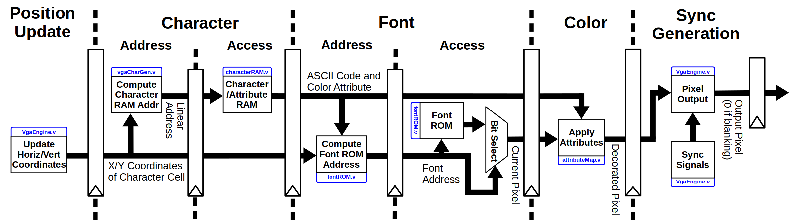
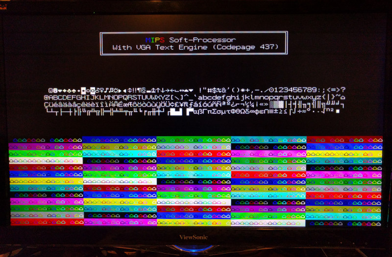
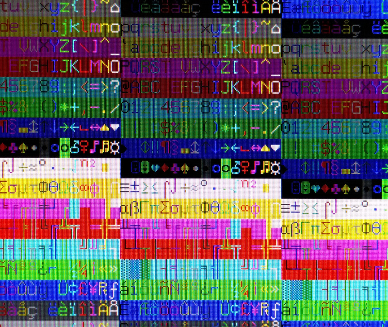

# VGA-CharGen
The VGA-CharGen is a memory-mapped, pipelined VGA text/character generator written in Verilog.  Intended to be used with soft processors, old-school computers, or other SoC-like environments, an attribute/character RAM is provided, operating in the host system's clock domain independent from the video logic.  This control interface is modeled after the old VGA (as in IBM's VGA) [Mode 3](http://wiki.osdev.org/Text_UI).

## Overview

In order to achieve pixel clock speeds sufficient for 1920x1080@60Hz and beyond, the VGA-CharGen breaks up the memory access and video generation into many small operations, occurring concurrently.  At present, this pipeline of activities is 7-stages deep from the perspective of the video clock. (The external host clock for writing into the dual-ported attribute/character RAM is independent).

## Screenshots
VGA-CharGen providing a memory-mapped text interface at 640x480@60Hz for an educational MIPS soft-processor

Resolutions exceeding 1920x1080@60Hz (shown here) are possible

